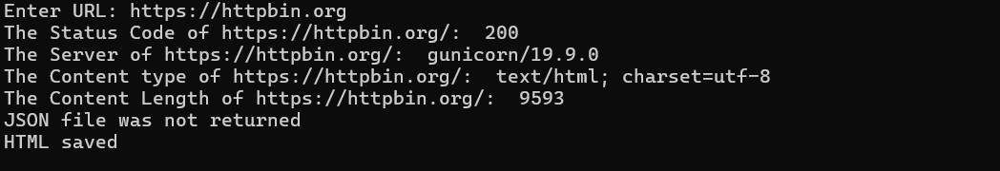

**Mini Recon Tool**:

A beginner-friendly Python tool for performing basic web reconnaissance using the requests library.
Built while learning HTTP fundamentals and Python automation.

**Features**:

1. Fetches HTTP status code

2. Extracts important response headers like:

   (i) Server

  (ii) Content-Type
  
(iii)  Content-Length

3. Safely detects and prints JSON responses

4. Saves webpage HTML with proper UTF-8 encoding

5. Handles timeouts and network error

6. Normalizes user input URLs

**Requirements**:
1. Python 3.x
  
2. requests library

Install dependency:
1. pip install requests
   
**Usage**:

python minirecon.py

Then enter a full URL such as:

https://httpbin.org

**Example Output**:

**Learning Goals**:

**This project was built to practice**:

1. Working with the requests library

2. Handling HTTP responses

3. Error handling in Python

4. Basic recon workflow used in cybersecurity

**Future Improvements**:

1. Add path fuzzing module

2. Support multiple URLs from a file

3. Show response time

4. Save results to a report

*Built for learning and experimentation in web security*.
